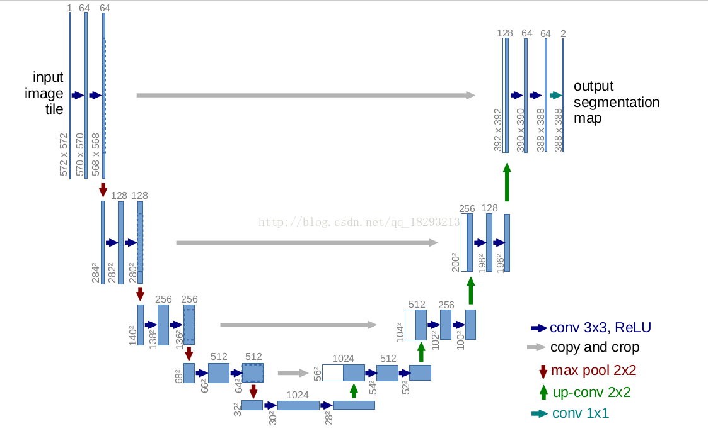
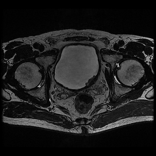
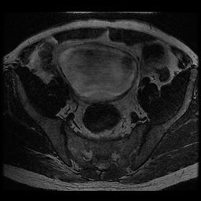
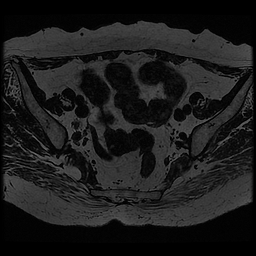
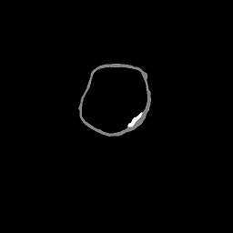

# MRI-U-net

**基于U-net和MRI图像的膀胱壁边缘以及膀胱肿瘤检测**

膀胱癌位居男性恶性肿瘤发病率第四、死亡率第八，
由于复发率高，患者多在诊断、治疗、复发、再治疗中循环
，是目前花费最高的癌症之一。实现膀胱肿瘤的早期检测对于预防
膀胱癌、降低死亡率、提高患者生活质量具有重要意义。

数据格式介绍：所有训练集数据，都是二维png格式图像，患者的数据以“IM”
开头，标记的图像以“Label”开头，后面的数字代表图像编号。在标记图像中，
我们已将肿瘤区域（灰度值255）和膀胱壁区域（灰度值128）分开。

**文件说明**

    │  README.md 项目介绍
    ├─data
    │     README.md 数据说明
    │
    ├─img 图片
    │
    │
    ├─model
    │      README.md 模型说明
    │      slurm-35844.out 训练时产生的数据文件
    │      
    └─src
            Main.py 主程序
            UNetKeras.py U-net类
            utils.py 基础工具

**U-net基本结构**

由于本项目最终做的是多（3）分类，因此在在最后一层用的是Softmax激活函数并且最后一层的通道为分类数（即3）。

**数据**

_**三种不同种类的数据：**_

- 肿瘤患者膀胱壁区域切片
- 正常人膀胱壁区域切片
- 非膀胱壁区域切片

Image:

   

Label:

  

**_开发环境_**

- Python3.6+
- TensorFlow1.8+
- Keras
- Numpy
- Sklearn 0.19.1
